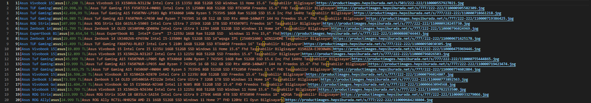
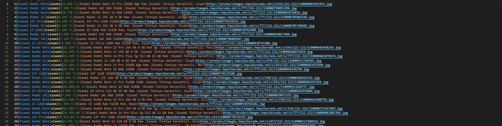
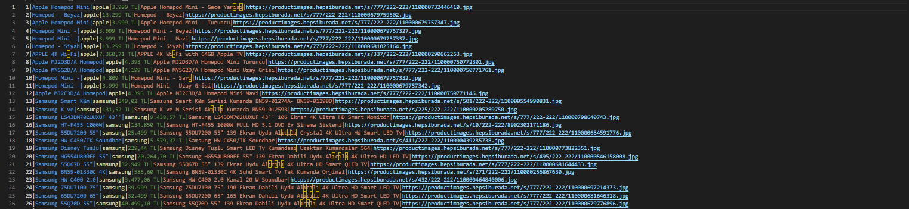
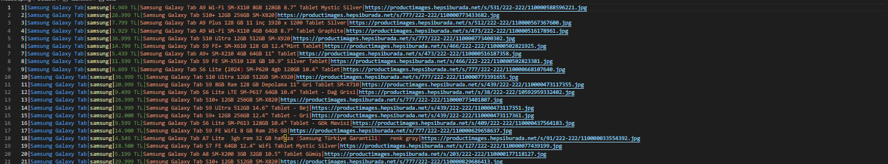

<h1 style="text-align:center">HEPSIBURADA WEB SCRAPING</h1>

We have performed data scraping with selenium in python language for sample data from some categories via Hepsiburada. According to the models under categories such as Phone and Computer, fees, descriptions, models, visuals were taken and transferred to txt files under the categories.

<h3 style="font-size:16px">PROGRAM IMAGES</h3>

    
    
    
    
    

